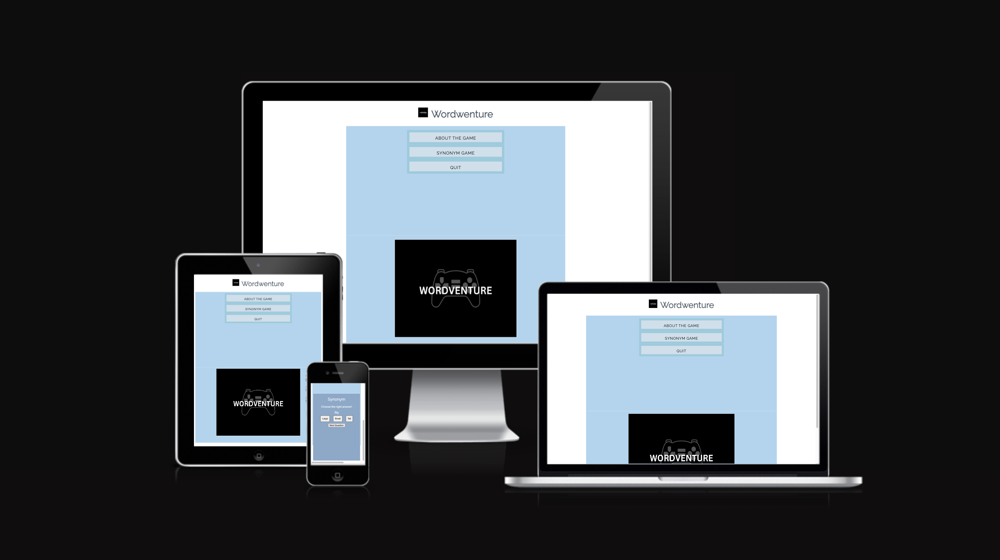
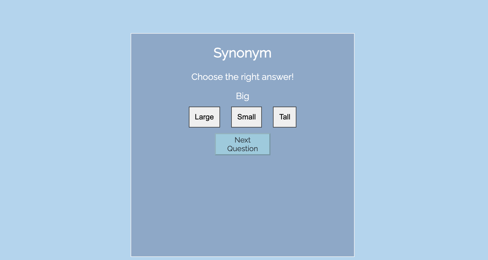

# Wordventure

## Site Overview

Wordventure is a simple web-based game that tests player knowledge while also developing vocabulary skills. The game includes a flipping card that reveals the word and various possibilities from which the player must select a synonym. As a result, the player will gain 10 points for the correct response, which will be added to the final score. The maximum attainable score is 100 points.This game is a fun way to put your knowledge to test and learn new words.

## Features

* The header, which appears at the top of the page, displays the game name and includes the game logo: Wordventure.
* The header informs the player that the game contains words.

## The Game Menu

* The game menu is providing to the player three main options to choose from: About the Game, Synonym Game and Quit.
* About the Game: Simply clicking on the button changes the area under the menu and displays some information about the game, the game rules, how the points are accumulated based on the player selections, and what the maximum final score can be.
* Synonym Game: Simply clicking on the button will display the card containing the game in the area under the menu. Moving the mouse over the card will also cause it to flip, revealing the game layout, which will display the task phrase, the word allocated, and the three options to choose from.
* Quit: Simply clicking on the button will display the game name and a thank you message to the player for playing the game.

## Game Layout

* The main game is incorporated within a card, which flips when the mouse is hoverd or clicked over.
* It includes a heading of synonym, followerd by a simple phrase that is saying to the player to "Choose the right answer!".
* The interactive game part is including a word and three options to choose from. If the player is choosing the right option this will be coloured green, but if the wrong option is chosen, then is will be coloured red.
* The ponits are added as follow: 10 points are added for each right answer and 10 points are subtracted for each wrong answer. 
* The player score will be shown after all words will be completed.

## Footer

* The footer is including two links to one of the social media platforms, such as LinkedIn and a link to the GitHub profile

