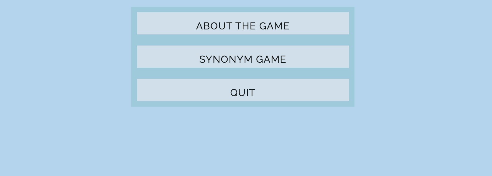
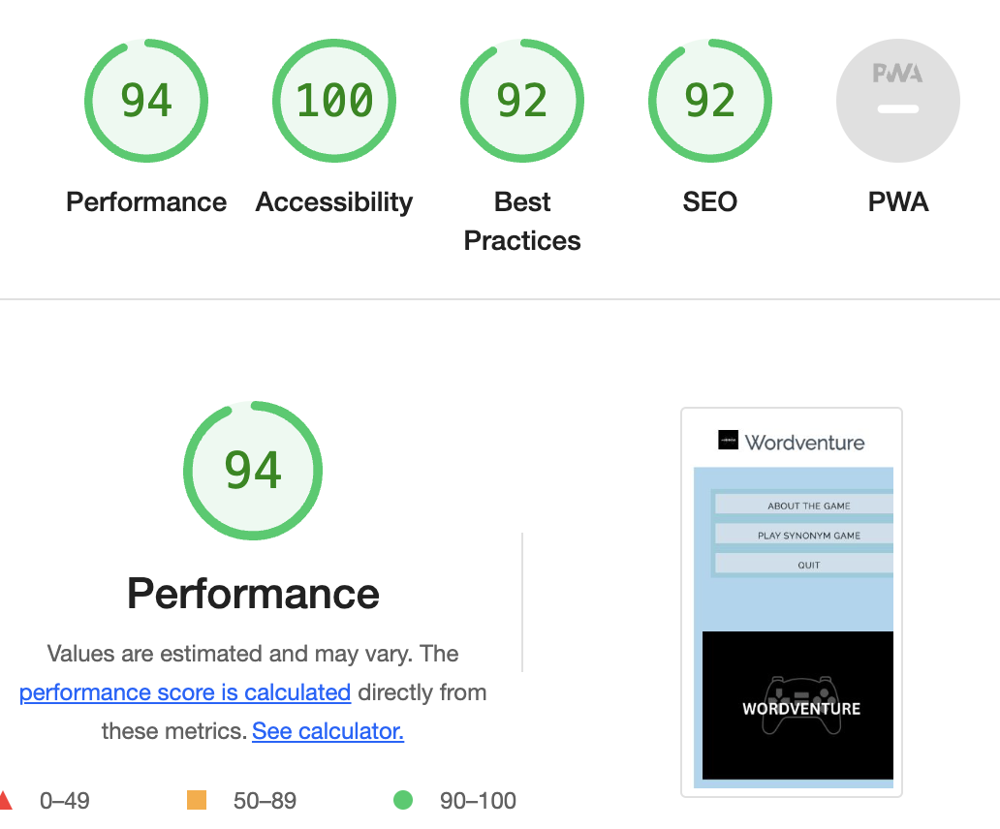

# Wordventure

## Site Overview

Wordventure is a simple web-based game that tests player knowledge while also developing vocabulary skills. The game includes a flipping card that reveals the word and various possibilities from which the player must select a synonym. As a result, the player will gain 10 points for the correct response, which will be added to the final score. The maximum attainable score is 100 points.This game is a fun way to put your knowledge to test and learn new words.

## Planning 

### Game Inspiration

The game idea was influenced by my wish in becoming confident of my English vocabulary, as frequently is hard to associate words with their synonyms. 

### Target Audience:

* The game is for everyone that wants to improve their English skill
* It can be played by adults, teenagers as well as children.

### Game colors

The color scheme was simply based on blue colors, for a simple and clean look and adding some black color to the game logo for contrast.

The below color grid was created by using https://contrast-grid.eightshapes.com 

## Features

### Header

* The header, which appears at the top of the page, displays the game name and includes the game logo: Wordventure.
* The header informs the player that the game contains words.

### The Game Menu

* The game menu is providing to the player three main options to choose from: About the Game, Synonym Game and Quit.
* About the Game: Simply clicking on the button changes the area under the menu and displays some information about the game, the game rules, how the points are accumulated based on the player selections, and what the maximum final score can be.
* Synonym Game: Simply clicking on the button will display the card containing the game in the area under the menu. Moving the mouse over the card will also cause it to flip, revealing the game layout, which will display the task phrase, the word allocated, and the three options to choose from.
* Quit: Simply clicking on the button will display the game name and a thank you message to the player for playing the game.

### Game Layout

* The main game is incorporated within a card, which flips when the mouse is hoverd or clicked over.

* It includes a heading of synonym, followerd by a simple phrase that is saying to the player to "Choose the right answer!".
* The interactive game part is including a word and three options to choose from. If the player is choosing the right option this will be coloured green, but if the wrong option is chosen, then is will be coloured red.
* The ponits are added as follow: 10 points are added for each right answer and 10 points are subtracted for each wrong answer. 
* The player score will be shown after all words will be completed.

### Footer

* The footer is including two links, displayed with Font Awesome icons, to platforms such as LinkedIn and GitHub profile.

### Features for the Future

This game evolved into somewhat of a passion project, however given the short timeframe and short period of time required to learn Javascript, I decided that for the future to review the game and implement more features that will improve the game: 

* Including a second game option that will focuse on antonyms.
* Improving the game questions by including AI words generation, this making the game more intristing and challenging.

## Testing

* I tested the game by playing it on different browsers: Chrome, Safari, Firefox.
* The game score counter is correct.
* I confirmed that the header, instructions, options, resilts and footer text are all readable and easy to understand.
* Running the project through Lighthouse in the devtools has allowed me to ensure that the colour and fonts are readable and accessible.

* By running the project through Wave Chrome extension I can confirme that there are no errores.

### Bugs

When testing the card fliping animation, a constant glitch was discovered. This problem was reviewed on the deployed project by using the devtools and I discovered that the flip-card class perspective within the style.css was set to a 100px insted of 1000px, this affecting the flip animation of the card.

### Validator Testing 

* HTML 
    - When running through the official W3C validator, there were no problems returned.
* CSS
    -  When running through the official (Jigsaw)validator, there were no problems returned.

### Unfixed Bugs

No unfixed bugs

## Deployment

* The site was deployed to GitHub Pages. The steps are as follows:
    - In the GitHub repository, navigate to the Settings tab.
    - From the left side menu select the Page tag
    - From the source section drop-down menu, select the Main Branch
    - Once the main branch has been selected and saved, the page provided the link to the completed website

The live link can be found here - [Wordventure](https://martaczm.github.io/Wordventure/)

## Credits

* Flip Card
    - The code implimented to the fliping card effect was adapted from [w3Schools](https://www.w3schools.com/howto/howto_css_flip_card.asp)

* Menu Buttons
    - The menu buttons code was adapted from the JavaScript - Love Maths project at Code Institute [Love-Maths](https://github.com/Code-Institute-Solutions/love-maths-2.0-sourcecode/tree/master/05-tidying-up/01-a-few-last-things)

* Footer Linkes
    - The footer linkes code was addapted from the previous Millestone Project [Peaceful-Mind](https://martaczm.github.io/peaceful-mind/)

* InnerHTML
    - The innerHTML code from the JavaScript file was adapted from [w3Schools](https://www.w3schools.com/jsref/prop_html_innerhtml.asp)